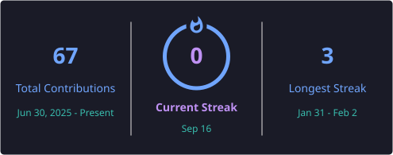

# 💫 About Me:
I am a third-year Computer Science and Engineering undergraduate with a strong interest in software development, machine learning, and building practical technology solutions. I have a diverse technical foundation across programming, web development, backend engineering, data structures, and machine learning, with hands-on experience in technologies such as Python, Java, C++, JavaScript, React.js, AngularJS, Django, FastAPI, Flask, SQL, and REST APIs.

I enjoy solving complex problems, learning new technologies, and understanding how different components of software systems work together. My academic journey has strengthened my foundation in Data Structures and Algorithms, programming, and problem-solving, while my development experience has helped me build an interest in designing efficient and scalable applications.

My current goal is to strengthen my expertise in software engineering and machine learning by working on meaningful projects, contributing to real-world products, and continuously improving my technical and problem-solving abilities. I aim to develop strong industry-level skills and eventually become a versatile software engineer capable of working across backend systems, intelligent applications, and modern full-stack technologies.

Beyond technical skills, I value critical thinking, continuous learning, teamwork, and adaptability. I am always looking for opportunities to challenge myself, learn from others, and turn ideas into useful and impactful solutions.

# 🌐 Socials:
    

# 💻 Tech Stack:
                                

# 📊 GitHub Stats:

 

 

---

<!-- Proudly created with GPRM ( https://gprm.itsvg.in ) -->
